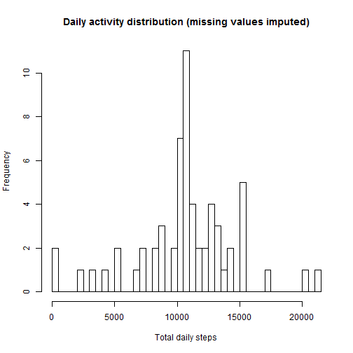

##Loading and preprocessing the data

The data is in the file activity.csv in the working directory. This file is read into an R dataframe activitydata using read.csv.


```r
activitydata <- read.csv("activity.csv", header=TRUE)
```

##What is mean total number of steps taken per day?

To answer this question the first step is to calculate the total number of steps taken each day. This is done by tapplying the sum function to the steps variable for each day. The result is assigned to an object totals.


```r
totals <- tapply(activitydata$steps, activitydata$date, sum)
```

A histogram showing the distribution of total daily steps is plotted using the hist plotting function. The number of bins for the histogram is set at 50.


```r
hist(totals, 50, main="Daily activity distribution (missing values removed)", xlab="Total daily steps")
```

 

We calculate the total number of steps recorded in the dataset.

```r
sum(activitydata$steps, na.rm=TRUE)
```

```
## [1] 570608
```

Finally we calculate the mean and median of the total steps taken per day. This is done using the mean and median functions. Missing values (NAs) are ignored by setting na.rm=TRUE.


```r
mean(totals, na.rm=TRUE)
```

```
## [1] 10766.19
```

```r
median(totals, na.rm=TRUE)
```

```
## [1] 10765
```

##What is the average daily activity pattern?

To answer this question we analyse activity levels in five-minute time intervals during each day.

The first step is to calculate the average number of steps taken in each time interval across all days. This is done by converting the interval variable to a factor then tapplying the mean function on steps across the intervals. The output of this procedure is assigned to an R object averagesteps.


```r
activitydata$interval <- as.factor(activitydata$interval)
averagesteps <- tapply(activitydata$steps, activitydata$interval, 
        mean, na.rm=TRUE)
```

The next step is to plot the average number of steps for each five minute time imterval.


```r
## assign the 288 values of the time interval variable (which is in column 3 of the dataset) to x
x <- activitydata[1:288,3]
## plot averagesteps (the average number of steps taken per time interval across all days) against x (the five-minute time interval) 
plot(x, averagesteps, main="Activity by time of day", xlab="Time interval",
        ylab="Average steps")
lines (x, averagesteps)
```

 

The plot shows the interval with the maximum number of average steps is around 9.00 am. We identify the exact interval with the maximum number of steps as follows.


```r
## strip away the attributes of averagesteps so that it comprises a vector of values
attributes(averagesteps) <- NULL
## create a dataframe with two columns: the daily time intervals and the average number of steps for each interval
newdf <- data.frame(x,averagesteps)
## which.max identifies the highest value of average steps. The dataframe is then subset to return the value of the corresponding time interval (in column 1 of the dataframe)
newdf[which.max(newdf$averagesteps),1]
```

```
## [1] 835
## 288 Levels: 0 5 10 15 20 25 30 35 40 45 50 55 100 105 110 115 120 ... 2355
```

This shows the relevant interval is 8:35 am.

##Imputing missing values

How many missing values are in the dataset?

```r
## calculate number of missing values
sum(is.na(activitydata$steps))
```

```
## [1] 2304
```

Given the presence of 2304 missing values, we should consider whether the pattern of missing values is distorting the analysis. We do this by imputing to each missing value the average number of steps per interval across the dataset.

```r
## calculate mean steps (removing missing values)
x <- mean(activitydata$steps, na.rm=TRUE)
## replace NAs with mean steps
activitydata$steps[is.na(activitydata$steps)] <- x
```

Using the imputed missing values, we plot a histogram of the total number of steps taken per day.


```r
## calculate total steps by day
totals <- tapply(activitydata$steps, activitydata$date, sum)
## plot histogram of total daily steps
hist(totals, 50, main="Daily activity distribution (missing values imputed)", xlab="Total daily steps")
```

 

The distribution here matches the distribution where missing values were removed. This suggests the presence of missing values is not distorting the analysis.

To test this further, mean and median values of total daily steps, with missing values imputed, are calculated.

```r
mean(totals)
```

```
## [1] 10766.19
```

```r
median(totals)
```

```
## [1] 10766.19
```

The mean and median values with imputed missing values are virtually identical to those obtained when the missing values were removed, confirming our conclusuoon that missing values are not biasing the results.

However, imputing missing values increases the estimate of the total number of steps taken over the two months covered by the dataset. This can be seen visually by the higher values in the second histogram compared to the first. We calculate the impact as follows.


```r
### total steps with imputed missing values
sum(activitydata$steps)
```

```
## [1] 656737.5
```

The total steps with imputed missing values is 656737.5 compared to 570608 ignoring the missing values (see above).

##Are there differences in activity patterns between weekdays and weekends?

To compare activity patterns between weekdays and weekend days requires creating a new factor variable with two levels: weekday and weekends. This is done in three steps. 

First the  date variable is converted from a character variable to an R date object.


```r
activitydata$date <- as.Date(activitydata$date, format="%d/%m/%Y")
```

Then we use the *weekday()* function to convert each date to the relevant day of the week.

```r
activitydata$weekday <- weekdays(activitydata$date)
```

Finally *gsub* is used to rewrite each day of the week to either "weekday" or "weekend". This variable is converted to a factor.


```r
activitydata$weekday <- gsub("Monday", "Weekday", activitydata$weekday)
activitydata$weekday <- gsub("Tuesday", "Weekday", activitydata$weekday)
activitydata$weekday <- gsub("Wednesday", "Weekday", activitydata$weekday)
activitydata$weekday <- gsub("Thursday", "Weekday", activitydata$weekday)
activitydata$weekday <- gsub("Friday", "Weekday", activitydata$weekday)
activitydata$weekday <- gsub("Saturday", "Weekend", activitydata$weekday)
activitydata$weekday <- gsub("Sunday", "Weekend", activitydata$weekday)
activitydata$weekday <- as.factor(activitydata$weekday)
```

Plots are created showing activity by five-minute intervals on weekdays versus weekend days.

To facilitate generating these plots, the interval variable is converted to a factor and the data is split into two data frames, one containing the weekday cases and the other containing the weekend cases.


```r
##convert interval to a factor
activitydata$interval <- as.factor(activitydata$interval)
##create separate dataframes with weekday and weekend cases
weekdaydata <- subset(activitydata, select=c(steps, date, interval, weekday),
      subset=(weekday=="Weekday"))
weekenddata <- subset(activitydata, select=c(steps, date, interval, weekday),
      subset=(weekday=="Weekend"))
```

The average number of steps for each interval is calcluated for weekdays and weekends by tapplying the *mean* function to the two new dataframes. The output is assigned to two new objects for plotting.


```r
averageweekdaysteps <- tapply(weekdaydata$steps, weekdaydata$interval, 
        mean, na.rm=TRUE)
averageweekendsteps <- tapply(weekenddata$steps, weekenddata$interval, 
        mean, na.rm=TRUE)
```

Now we make a panel containing two plots for weekdays and weekends.

```r
par (mfrow = c(2,1))
x <- activitydata[1:288,3]
plot(x, averageweekdaysteps, main="Weekday activity by time of day", xlab="Time interval",
        ylab="Average steps", ylim=c(0,200))
lines (x, averageweekdaysteps)
y <- activitydata[1:288,3]
plot(y, averageweekendsteps, main="Weekend activity by time of day", xlab="Time interval",
        ylab="Average steps", ylim=c(0,200))
lines (y, averageweekendsteps)
```

 

Inspecting the charts shows that on weekdays there is a peak in activity in the morning of over 200 steps per interval at around 8.30 am. This is followed by relatively low levels of activity (less than 100 steps per interval) for the rest of the day, although there are secondary peaks in the late afternoon and early evening. By comparison on weekends the morning peak in activity is somewhat lower (around 150 steps per interval) and comes a little later (around 9.15 am). However on  weekends there are higher levels of activity (around 100 steps or more per interval) throughout the afternoon and early evening.  

